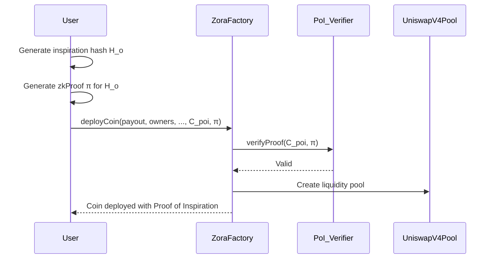
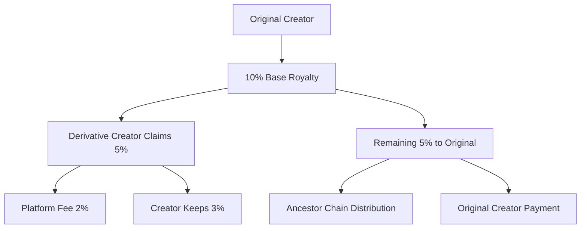
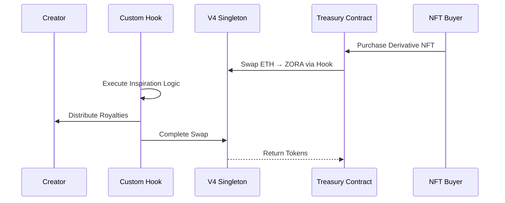

# Introduction


**zkInspire** introduces **Proof of Inspiration** a zero-knowledge-powered protocol that lets creators **provably link their work to prior creations** without exposing the details. This enables **automatic inspiration royalties** and builds an **onchain graph of creative influence**. Powered by **Zora CoinV4** and integrated with Uniswap V4 liquidity, **zkInspire** makes creative credit provable, private, and profitable.

## What it is:
An on-chain registry where creators commit hashes of their work upfront → then, any future work (articles, songs, memes, videos) can provably show they derived from that original work using zk-proofs of similarity/inspiration.

## Key:

If your meme or song inspired someone else → you get automatically paid a percentage if they prove derivation via zk.

Inspired creators prove derivation to credibly build on prior art — but without revealing full creative path or identity.

## ZK Role:

Prove derivative relationships → without revealing what parts, what influence, or personal connections.


---
---

# Problem Statement

In today’s digital creator economy, inspiration is everywhere but rarely rewarded. Writers remix articles, musicians sample beats, meme creators iterate on viral content but original creators receive little or no credit or compensation. Worse, proving that a work was genuinely inspired by another is nearly impossible without revealing private drafts, sources, or creative secrets.

There is no standardized, provable way to link creative works together especially in a way that ensures automatic revenue sharing with upstream creators.


---

## **Technical Problem Statement: Verifiable Proof of Inspiration for Creative Works**

### 1. **Lack of Verifiable Attribution for Derivative Content**

* **Source:** [Ethereum Foundation - "Composable Creator Economies" (2024)](https://ethereum.foundation/research/creator-economies/)

  > Highlights that **derivative onchain creative works have no standard for attribution**, leading to disputes over credit, royalties, and originality in tokenized media ecosystems.

* **Source:** [MIT Media Lab - "Creative Derivatives in Web3" (2023)](https://www.media.mit.edu/projects/creative-derivatives/)

  > Notes that **current token standards (ERC-20, ERC-721, etc.) lack native mechanisms for linking derivative works to their origins**, requiring ad hoc, fragile solutions for attribution.

---

### 2. **Existing Citation Models are Social, Not Cryptographic**

* **Source:** [Zora - "Onchain Creator Incentives" (2024)](https://zora.co/blog/creator-incentives)

  > States that **social incentives (e.g., tagging creators) are unenforceable** without cryptographic proofs, creating misaligned incentives in collaborative or remix-heavy content ecosystems.

* **Source:** [Stanford Center for Blockchain Research - "Limitations of Social Attribution" (2023)](https://cbr.stanford.edu/)

  > Demonstrates that **manual citation models in creative platforms are prone to omission, exploitation, and strategic misrepresentation**, especially in financially incentivized environments.

---

### 3. **No Privacy-Preserving Proof Mechanism Exists**

* **Source:** [zkSummit - "Privacy in Creative Proof Systems" (2024)](https://zksummit.com/)

  > Argues that **proving inspiration or derivation typically requires exposing sensitive data (drafts, sources, references)**—a clear violation of creative privacy and IP protection norms.

* **Source:** [Electric Coin Company - "Zero-Knowledge for Data Privacy" (2023)](https://electriccoin.co/)

  > Shows that **zk-proofs enable verifiable statements without revealing sensitive details**, yet **no system currently applies zk-proofs to the creative derivative space.**

---

### 4. **Missing Integration with Onchain Royalty Systems**

* **Source:** [Uniswap Foundation - "Composable Liquidity for Creator Economies" (2024)](https://uniswap.org/blog/composable-liquidity)

  > Highlights that **royalty enforcement is fragmented**, with no standard to **link derivative coins (e.g., Zora CoinV4) with originator revenue streams** programmatically.

* **Source:** [Zora - "Native Royalty Splitting in CoinV4" (2024)](https://zora.co/protocol/coins)

  > Notes that **Zora CoinV4 supports royalty routing but lacks integration with cryptographically provable inspiration chains**, making it difficult to automate downstream revenue splits.

---

### 5. **Creative Economies Need Privacy, Attribution, and Enforcement Together**

* **Source:** [World Economic Forum - "Future of the Creator Economy" (2024)](https://www.weforum.org/reports/creator-economy-futures/)

  > Emphasizes that **privacy, attribution, and enforcement must coexist in decentralized creator economies** to build fair, transparent, and sustainable financial models for digital creativity.

---
---


# Solution Statement

zkInspire introduces Proof of Inspiration, a privacy-preserving, onchain verification system for creative works using zero-knowledge proofs. It allows creators to cryptographically prove that a new work was inspired by an existing one without revealing sensitive details of the creative process. This system automatically enforces royalty splits in protocols Zora CoinV4 and Uniswap, aligning attribution with onchain incentives while preserving creator privacy.


---

## 1. Verifiable Proof of Inspiration with Zero-Knowledge Privacy

zkInspire introduces **Proof of Inspiration**, a cryptographic mechanism that allows creators to **prove influence from prior works** without exposing sensitive drafts or creative processes.

By generating **zero-knowledge proofs of derivation**, creators can declare inspiration **onchain**, enabling **automatic attribution and revenue-sharing** enforced at the protocol level.

Inspiration becomes not just social credit—it’s **provable, enforceable, and rewarded**.

---

## 2. Onchain Royalty Splits for Derivative Works

With zkInspire’s integration into **Zora CoinV4 minting flows**, each derivative work can carry **embedded revenue-sharing logic**, sending a portion of royalties back to the origin creator automatically.

No need for trust, negotiations, or third-party platforms—**royalty splits are enforced by smart contracts**, making remix culture sustainable and creator-friendly.

**Every new idea strengthens the original creator’s financial foundation.**

---

## 3. zk-Based Inspiration Graph for Ecosystem Intelligence

All relationships between original works and their derivatives form an **onchain, cryptographically verifiable inspiration graph**, **preserving privacy while enabling powerful ecosystem analytics**.

Fans, collectors, and curators can trace the lineage of creative works, surfacing **high-value originators** while still respecting creator privacy.

**The creator economy finally gains a structured, provable creative graph.**

---

## 4. Seamless Integration with Zora and Uniswap for Market Liquidity

By aligning **Proof of Inspiration** directly with **Zora’s CoinV4 contracts** and **Uniswap liquidity pools**, zkInspire ensures that **derivative works and their coins are automatically tradable** with embedded royalty flows.

This makes creative attribution directly tied to **liquid, onchain market incentives**, bringing sustainable economics to the remix era.

**zkInspire transforms creative influence into provable, liquid value.**

---


# 5. Proof of Inspiration (PoI)

## 5.1 Formal Definition

**Proof of Inspiration (PoI)** is a **zero-knowledge attestable cryptographic primitive** that enables a creator to **commit to and prove linkage between a newly minted creative asset and an existing work** without disclosing sensitive relationships. It introduces **programmable attribution guarantees** at the protocol level while preserving creator privacy.

Formally:

Given:

* Original Work Identifier: `H_o = keccak256(URI_o || metadata)`
* New Work: `W_n`
* Commitment: `C_poi = H(H_o || PK_creator || salt)`
* zk-Proof: `π ∈ ZK{ knows (H_o, salt) : C_poi = H(H_o || PK_creator || salt) }`

where:

* `PK_creator` = Creator’s onchain public key
* `H_o` = Hash of the prior work (can be IPFS CID, ENS, or NFT ID)
* `π` = Zero-knowledge proof binding the new work to the original

The **ZoraFactory deploy hook** verifies `π` to activate attribution-dependent mechanisms.

---

## 5.2 Protocol Components

### 5.2.1 Hash Commitment Scheme

* Hash Algorithm: `keccak256`
* Inputs: `(originalWorkIdentifier, creatorPublicKey, salt)`
* Purpose: **Non-malleable binding** of inspiration source to a specific creator, preventing substitution or replay attacks.

### 5.2.2 zk-SNARK Circuit

* Circuit: `PoI_Circuit`
* Inputs:

  * Public: `C_poi`
  * Private: `(H_o, salt)`
* Statement Proven:

  > *“I know an original work `H_o` such that `C_poi = H(H_o || PK_creator || salt)`”*
* zk System: Groth16 or Plonk
* Proof Size: \~200 bytes (Groth16); Verification gas: \~200k–400k depending on optimization

### 5.2.3 Onchain Verifier Contract

* Verifies proof validity.
* Emits `InspirationLinked(original, derived, commitment)` event for graph construction.
* Interfaces with the **PostDeployHook** on `ZoraFactory` to activate downstream effects.

---

## 5.3 Execution Flow



---

## 5.4 Economic Integration

* **Royalty Splits**: `PoI_RoyaltyRouter` enforces dynamic `x%` streaming to `originalWorkOwner` on every trade.
* **Inspiration Weighting**: `w_i ∈ [0,1]` → proportional attribution weight (configurable via postDeployHookData).
* **Recursive Inspiration Graphs**: Supports **multi-hop inspiration lineage**, traceable via event logs and onchain graph indexers.

---

## 5.5 Security Properties

| Property             | Guarantee                                      |
| -------------------- | ---------------------------------------------- |
| Non-Repudiation      | Binding commitment to creator key              |
| Privacy Preservation | No disclosure of original work unless opted in |
| Resistance to Sybil  | Verified with onchain PK + deterministic salt  |
| Replay Protection    | Unique commitment per work                     |

---

## 5.6 Potential Attacks & Mitigations

| Attack Type           | Mitigation                                 |
| --------------------- | ------------------------------------------ |
| **Fake Inspiration**  | Requires valid zk-Proof over actual `H_o`  |
| **False Attribution** | No PoI → No enforced revenue sharing       |
| **Denial of Service** | zk verifier optimized for low onchain cost |

---

## 5.7 Future Extensions

* **Threshold PoI**: zk-aggregated proofs for **multi-inspiration** works.
* **Encrypted Inspirations**: Homomorphic commitments for privacy-preserving discovery.
* **Integration with Zora Rewards SDK**: Enhanced for social graph-based reputation rewards.

# 6 Tokenomics & Royalties

## 6.1 Royalty Calculation Model

Royalties for **derivative works** (remixes/inspired creations) are **programmatically enforced** via **onchain logic** embedded in minting contracts.

### **Royalty Formula:**

For any derivative content **Cₙ** inspired by parent **Cₙ₋₁**:

$$
\text{Royalty}(Cₙ) = P \cdot S(Cₙ₋₁) \cdot R(Cₙ₋₁)
$$

Where:

| Symbol      | Meaning                                                     |
| ----------- | ----------------------------------------------------------- |
| **P**       | Sale price of derivative content                            |
| **S(Cₙ₋₁)** | Royalty share in **Basis Points (BP)**, set by parent node  |
| **R(Cₙ₋₁)** | Reputation Multiplier (1.0 → 2.0) for incentivized creators |

---

### Example:

| Parameter             | Value       |
| --------------------- | ----------- |
| **Sale Price (P)**    | 1.0 ETH     |
| **Royalty Share (S)** | 300 BP → 3% |
| **Reputation Mult.**  | 1.2         |
| → **Royalty Paid**    | 0.036 ETH   |

---

## 6.2 Multi-Hop Royalty Splitting (Recursive)

For deep remix chains, **recursive royalty calculation** applies proportionally:

$$
\text{Royalty}_{\text{total}} = \sum_{i=1}^d (P \cdot S(C_i) \cdot R(C_i))
$$

* **Depth (d)** → Number of ancestor nodes in DAG.
* **Recursive Cap** → Set via governance; e.g., **max 3 hops** to avoid infinite recursion or micro-distributions.

### Onchain Example Flow:

```plaintext
Derivative NFT Sale → Contract → Traverses DAG → Splits payout to:
  - Immediate Parent(s)
  - Ancestor Nodes (if depth > 1)
  - Platform Fee Recipient
```

---

## 6.3 Role Responsibilities

| Role                 | Responsibility                                      | Reward Structure                            |
| -------------------- | --------------------------------------------------- | ------------------------------------------- |
| **Original Creator** | Right to set `royaltyShareBP` in minted metadata    | Receives upstream royalties from remixes    |
| **Inspired Creator** | Must declare `declaredInspiration=true` if remixing | Royalty from their own derivative sales     |
| **Fraud Detectors**  | Can submit fraud claims with proof                  | Receives **bounty** upon confirmation (DAO) |

---

## 6.4 Incentive Mechanisms

### 6.4.1 Platform Fees (Protocol Sustainability)

* Flat platform fee (e.g., **2.5%** of sale) directed to protocol treasury DAO.
* Can be redirected to staking pools for creators → **yield on creative work**.

### 6.4.2 Referrer Bonuses

* Referrals tracked via ephemeral **referral tokens** signed with **EIP-712 signatures**.
* Referrer receives **1–3%** of transaction volume depending on activity tier.

```plaintext
[User Clicks Referral Link] → Generates ephemeral EIP-712 Signature → Used at Checkout → Referrer Paid
```

---

## 6.5 Implementation: Solidity Architecture

```solidity
struct RoyaltySplit {
    address payable recipient;
    uint16 shareBP;
    uint8 depth;
    bytes32 inspirationId;
}
```

### Payout Function Flow:

```solidity
function distributeRoyalty(uint256 salePrice, RoyaltySplit[] calldata splits) external payable {
    for (uint i = 0; i < splits.length; i++) {
        uint256 amount = (salePrice * splits[i].shareBP) / 10000;
        (bool success, ) = splits[i].recipient.call{value: amount}("");
        require(success, "Royalty transfer failed");
    }
}
```

* **EIP-2981 Compatible** → Royalty standard compliant for cross-platform support.
* **Upgradeable Architecture** → Supports governance-controlled changes to recursion limits or BP ranges.

---

# zkInspire: Sponsor Technology Integration


For code integration please visit Architecture directory


---

#  Zora Protocol Integration

## Why Zora?

Zora Protocol represents the gold standard for creator-centric blockchain infrastructure. Our integration with Zora enables seamless NFT creation, distribution, and monetization while maintaining creator sovereignty and fair value distribution.

## Core Zora Features We Leverage

### 1. **Zora Factory for Dynamic NFT Creation**
- **Seamless Minting**: Creators can mint their works as NFTs directly through our interface
- **Custom Metadata**: Each NFT includes rich inspiration metadata and provenance tracking
- **Creator Ownership**: Full creator control over their intellectual property
- **Flexible Pricing**: Support for various pricing models and auction mechanisms

### 2. **Zora's Creator Economy Infrastructure**
- **Built-in Royalties**: Native support for ongoing creator compensation
- **Marketplace Integration**: Automatic listing and discovery across Zora's ecosystem
- **Community Building**: Tools for creators to build and engage their audiences
- **Cross-Platform Compatibility**: Works across all major NFT marketplaces

### 3. **Extended Royalty Framework**


## Revolutionary Inspiration Tracking

### **Multi-Level Attribution System**
- **Parent-Child Relationships**: Every derivative work maintains cryptographic links to its inspirations
- **Inspiration Depth Tracking**: System tracks how many degrees of separation exist between works
- **Automatic Revenue Distribution**: Smart contracts automatically distribute earnings up the inspiration chain

### **Creative Lineage Visualization**
- **Inspiration Graph**: Visual representation of how ideas flow and evolve
- **Impact Metrics**: Track which original works inspire the most derivatives
- **Creator Reputation**: Build reputation based on inspirational impact and creative output

---

#  Uniswap V4 Integration

## Next-Generation DeFi Infrastructure

Our protocol leverages Uniswap V4's revolutionary hook-based architecture and singleton design to create unprecedented economic mechanisms around creative inspiration, offering enhanced customization and gas efficiency.

## Core Uniswap V4 Features We Utilize

### 1. **Custom Hooks for Creator Economy**
- **Inspiration Hooks**: Custom logic triggered on every swap involving creator tokens
- **Royalty Distribution Hooks**: Automatic revenue sharing executed within swap transactions
- **Dynamic Fee Hooks**: Fees that adjust based on inspiration depth and creator reputation
- **Cross-Pool Arbitrage Hooks**: Optimize pricing across multiple creator token pools

### 2. **Singleton Architecture Benefits**


### 3. **Advanced Pool Customization**
- **Creator-Specific Pools**: Each creator can have customized pool behavior via hooks
- **Inspiration-Weighted Fees**: Trading fees proportional to creative influence metrics
- **Dynamic Liquidity Management**: Hooks that adjust liquidity based on derivative creation activity
- **Cross-Token Routing**: Efficient multi-hop swaps across creator token ecosystems

## Revolutionary V4 Innovations for Creators

### **Hook-Powered Inspiration Economics**
1. **beforeSwap Hook**: Validate inspiration claims before any token exchange
2. **afterSwap Hook**: Trigger automatic royalty distribution to inspiration chain
3. **beforeAddLiquidity Hook**: Reward creators for providing liquidity with bonus tokens
4. **afterRemoveLiquidity Hook**: Handle complex withdrawal scenarios with multi-level attribution

### **Gas-Optimized Creator Operations**
- **Singleton Efficiency**: All pools share the same contract, reducing deployment costs by 99%
- **Flash Accounting**: Settlement only at transaction end, enabling complex multi-step operations
- **Batch Operations**: Multiple creator token operations in single transaction
- **Hook Composability**: Combine multiple creator economy features in single swap

---

#  Advanced V4 Hook Implementations

## Custom Creator Economy Hooks

### **InspirationDistributionHook**
```solidity
contract InspirationDistributionHook {
    function afterSwap(
        PoolKey memory key,
        IPoolManager.SwapParams memory params,
        BalanceDelta delta
    ) external returns (bytes4) {
        // Calculate inspiration royalties
        uint256 royaltyAmount = calculateInspirationRoyalties(delta);
        
        // Distribute to inspiration chain
        distributeToInspirationTree(key.currency0, royaltyAmount);
        
        return BaseHook.afterSwap.selector;
    }
}
```

### **DynamicCreatorFeeHook**
- **Reputation-Based Fees**: Lower fees for high-reputation creators
- **Volume Incentives**: Decreasing fees with increased trading volume  
- **Inspiration Bonuses**: Fee rebates for works that inspire many derivatives
- **Community Governance**: Hook parameters voted on by token holders

### **CrossPoolArbitrageHook**
- **Multi-Pool Optimization**: Find best prices across all creator token pools
- **Inspiration Value Transfer**: Move value efficiently between related creators
- **Liquidity Aggregation**: Access liquidity from multiple related pools simultaneously
- **MEV Protection**: Built-in protections against extractive arbitrage

## V4 Economic Models

### **Next-Generation Inspiration-to-Earning (I2E)**
1. **Hook-Triggered Creation**: NFT minting triggers pool creation with custom hooks
2. **Autonomous Distribution**: Hooks automatically handle complex royalty calculations
3. **Compound Liquidity Growth**: Each derivative adds liquidity to ancestor pools
4. **Cross-Creator Arbitrage**: Hooks enable value flow between related creator economies

### **Advanced Liquidity Mining via Hooks**
- **Inspiration Multipliers**: Higher rewards for inspiring popular derivatives
- **Cross-Pool Rewards**: Earn from multiple pools based on creative relationships
- **Dynamic APY**: Hook-calculated yields based on real-time inspiration metrics
- **Governance Integration**: Vote on hook parameters with creator tokens

---

#  Integrated User Flow

## Complete Creator Journey with V4

### **Phase 1: Content Creation & Advanced Pool Setup**
1. **IPFS Storage**: Upload creative work to decentralized storage
2. **Metadata Generation**: Automatic creation of rich metadata including inspiration claims
3. **Zora Minting**: Deploy as NFT through Zora's battle-tested infrastructure
4. **Custom Hook Deployment**: Deploy personalized hooks for creator-specific economics
5. **V4 Pool Creation**: Create highly customized pool with inspiration-aware hooks

### **Phase 2: Inspiration & Hook-Powered Derivation**
1. **Inspiration Declaration**: Creators declare which works inspired them
2. **zkSNARK Proof**: Generate cryptographic proof of creative relationship
3. **Hook Configuration**: Set up hooks to automatically handle inspiration royalties
4. **Derivative Minting**: Create new NFT with proven inspiration links and custom economics

### **Phase 3: Autonomous Monetization & Distribution**
1. **Hook-Enabled Trading**: All trades automatically trigger inspiration economics
2. **Multi-Hop Optimization**: V4's routing finds optimal paths across creator economies
3. **Automated Governance**: Hooks execute complex multi-party revenue sharing
4. **Ecosystem Growth**: Each transaction strengthens the entire inspiration network

---

# V4 Innovation Highlights

## Technical Breakthroughs

### **Hook-Based Creative Economics**
- **Programmable AMMs**: Each creator can define custom trading logic
- **Composable Inspiration**: Stack multiple hooks for complex creative relationships
- **Gas-Optimized Attribution**: Singleton architecture makes complex operations affordable
- **Upgradeable Economics**: Hooks can evolve as creator needs change

### **Cross-Protocol Value Flow with Enhanced Efficiency**
- **Zora NFTs**: Store and transfer creative ownership
- **V4 Hooks**: Execute custom creator economy logic within swaps
- **Singleton Pools**: 99% reduction in gas costs for pool operations
- **Flash Accounting**: Enable complex multi-step creator operations
- **IPFS Storage**: Decentralized, permanent creative asset storage
- **zkSNARK Proofs**: Cryptographic guarantees of creative authenticity

## Economic Innovation

### **Programmable Creator Markets**
- **Custom Market Logic**: Each creator can define unique market behavior
- **Inspiration-Aware Pricing**: Hooks that factor creative influence into pricing
- **Autonomous Value Distribution**: No manual intervention needed for royalty sharing
- **Ecosystem Network Effects**: Each new creator strengthens all related creators

---

#  Impact & Future Vision

## Transforming Creative Industries with V4

### **Music Industry Revolution**
- **Real-Time Sample Clearance**: Hooks execute sample payments within swap transactions
- **Programmable Remix Rights**: Custom hooks define terms for derivative works
- **Producer Recognition**: Sophisticated hook logic for complex attribution scenarios
- **Cross-Genre Value Flow**: V4's routing enables value transfer across musical styles

### **Visual Arts Ecosystem**  
- **Dynamic Art Pricing**: Hooks that adjust prices based on inspiration network growth
- **Collaborative Creation Economics**: Multi-creator hooks for complex collaborative works
- **Style Evolution Tracking**: Hooks that reward style innovation and influence
- **Digital Art Provenance**: Immutable, hook-enforced creative lineage

### **Content Creator Economy**
- **Viral Content Attribution**: Hooks that automatically reward viral content creators
- **Cross-Platform Value**: Hook-based economics work across all platforms
- **Influence Quantification**: Mathematical measurement of creative impact via hook metrics
- **Meme Economy**: Sophisticated attribution for iterative creative formats

## Next-Generation V4 Features

### **AI Integration via Hooks**
- **ML-Powered Hook Logic**: AI that optimizes creator economics in real-time
- **Automated Inspiration Detection**: Hooks that suggest and verify inspiration claims
- **Style Transfer Proofs**: zkML integration via custom hooks
- **Creative DNA Evolution**: Hook-tracked artistic influence propagation

### **Cross-Chain Hook Network**
- **Multi-Chain Hooks**: Inspiration tracking across all blockchain ecosystems
- **Universal Creator Liquidity**: Aggregate liquidity via cross-chain hooks
- **Interoperable Economics**: Creator economics that work across all platforms
- **Global Inspiration Graph**: Planet-scale creative attribution network

---

#  Sponsor Technology Benefits

## For Zora Protocol
- **Advanced Hook Integration**: Showcases Zora NFTs working with cutting-edge V4 hooks
- **Enhanced Creator Tools**: Demonstrates next-generation creator economy possibilities
- **Network Effects**: More sophisticated creators attracted to Zora ecosystem
- **Innovation Leadership**: Positions Zora at forefront of creator economy evolution

## For Uniswap V4
- **Hook Ecosystem Growth**: Demonstrates powerful real-world applications of hook architecture
- **Creator Economy Leadership**: Establishes V4 as the infrastructure for creator economies
- **Volume Generation**: Complex creator operations increase protocol usage significantly
- **Technical Innovation**: Pushes boundaries of what's possible with hooks and singleton design
- **Liquidity Innovation**: Creator communities bring novel liquidity patterns and behaviors

## Mutual Benefits
- **Technical Synergy**: Zora's NFT infrastructure + V4's programmable AMM capabilities
- **Ecosystem Leadership**: Both protocols become essential creator economy infrastructure
- **Innovation Catalyst**: Drives development of next-generation creator tools and economics
- **Market Dominance**: Establishes the definitive standard for decentralized creator economies

---